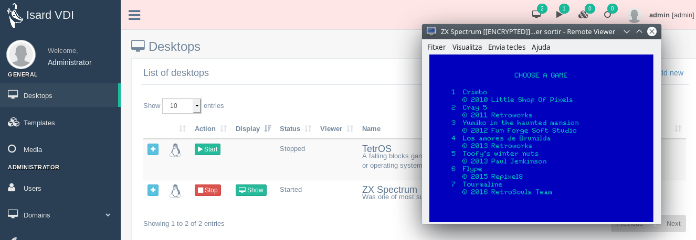
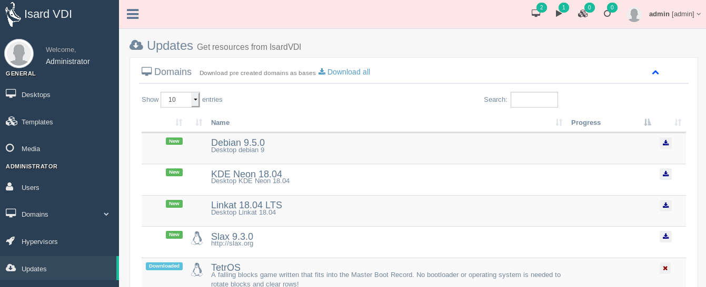
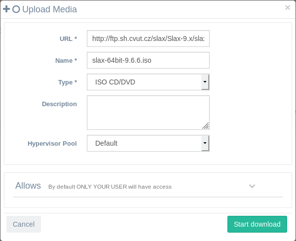
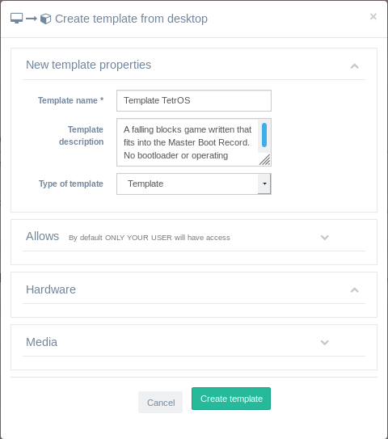

<h1>Primeros pasos</h1>

Una vez que tenga IsardVDI funcionando, podrá probar los escritorios de demostración a partir de las actualizaciones, pero también crear otros nuevos con cualquier ISO que pueda cargar. Ir al menú dektops para empezar.

[TOC]

# Escritorios de demostración

En el menú de **escritorios**, encontrará dos dominios de prueba que ya se descargaron durante el asistente (si marcó para obtener los escritorios de demostración).

- **TetrOS**: Un juego de caída de bloques escrito que encaja en el Master Boot Record. ¡No se necesita un gestor de arranque o sistema operativo para rotar bloques y borrar filas!
- **ZXSpectrum**: Fue una de las máquinas de 8 bits más exitosas de todos los tiempos.

Puede iniciarlo y aparecerá un formulario modal para seleccionar el visor que desea utilizar. Puede probarlo con las opciones del visor del navegador (spice o vnc) sin instalar ningún visor. Para un mejor rendimiento, conéctese con el cliente de especias (refer to [viewer section](../user/desktops.md#connect-to-viewer))

# Actualizaciones

Desde las actualizaciones, el administrador del menú puede descargar escritorios de ejemplo (dominios) que ya hemos optimizado.

Todos los dominios que pueden descargarse de las actualizaciones tienen, de forma predeterminada, el nombre de usuario y la contraseña pirineus. El usuario isard también tiene privilegios de superusuario.

# Crea tu escritorio

Los administradores y usuarios avanzados pueden crear sus propios escritorios cargando un archivo de instalación ISO a los medios. Los administradores pueden hacer uso del menú User Media y también del menú Administrator Domain Media.

Desde el menú User Media, haga clic en el botón + Agregar nuevo y se abrirá un formulario modal donde puede colocar la URL de la web con el ISO que desea descargar.

Cuando finalice la descarga, podrá crear un nuevo inicio de escritorio desde este archivo ISO haciendo clic en el icono verde del escritorio que se mostrará junto al archivo descargado.

Now fill in the modal form to create your desktop.

- Rellene el nombre y la descripción opcional.
- Seleccione una plantilla de sistema operativo de la lista (puede obtener más información del menú de actualizaciones). Debe ser lo más similar posible al sistema que va a instalar.
- Seleccione todo el hardware que desea que tenga su nuevo escritorio. Va a arrancar desde el ISO descargado, así que no modifique el arranque de ISO / CD.
- Si es una instalación de Win, puede marcar la casilla de verificación de instalación de Win (tiene detalles en el invitado de Windows) (first-steps.md#win-guest))

Después de eso, debería ver su nuevo escritorio creado en el menú Escritorios. Inícielo y su instalación ISO debería aparecer. Recuerde cambiar el arranque al disco duro cuando termine de instalarlo desde los detalles del escritorio.

## Invitado de Linux

Simplemente cargue un ISO en el sistema IsardVDI usando el botón Agregar nuevo arriba a la derecha en el menú Medios. Cuando termine de cargar, se mostrará un icono de escritorio a la derecha del archivo cargado. El ícono del botón del escritorio abrirá un nuevo formulario de escritorio que creará una instalación desde su linux ISO.

Una vez que termine de instalarlo, cierre el invitado y vaya a editar las propiedades del escritorio y cambie el dispositivo de arranque de CD / DVD a DISCO DURO.

## Ganar invitado

Siga el mismo proceso utilizado para un invitado de Linux pero, para obtener el mejor rendimiento de invitado de Win, deberá agregar algunos controladores manualmente antes de comenzar los pasos de creación:

1. Desde el menú Cargas, descargue el virtio win ISO y espere hasta que termine. Este ISO especial tiene controladores de gráficos Virtio y QXL para Win.

2. Subir una ISO ganadora a IsardVDI. Si desea cargarlo desde una computadora local, inicie un servidor web simple para servir a su archivo ISO y subirlo a IsardVDI.
3. Ahora vaya a crear un nuevo escritorio desde el botón del ícono del escritorio al lado de su contenido multimedia descargado y complete el nuevo formulario de escritorio. Asegúrese de marcar esta casilla de verificación Win Install iso y seleccione la plantilla de hardware adecuada de acuerdo con la versión de Win que se está instalando.

Durante la instalación, tendrá disponibles los archivos ISO de cd / dvd, su instalación de Win y los controladores de Virtio. Eso le permitirá agregar controladores de almacenamiento de Virtio durante la instalación y obtener el máximo rendimiento.

Una vez que termine de instalarlo, recuerde instalar en Win guest todos los demás controladores contenidos en Virtio Drivers ISO. Después de eso, puede eliminar todos los ISO de su escritorio editando las propiedades del escritorio y cambiando el dispositivo de arranque de CD / DVD a DISCO DURO.

# Creación de plantillas

Uno de los puntos fuertes de IsardVDI es la creación y el intercambio rápidos de plantillas. Su sistema de plantillas ha sido optimizado para ser lo más rápido posible. Tendrás tu plantilla lista para ser compartida en unos pocos segundos.

Cuando termine de instalar y configurar su escritorio, apáguelo correctamente. ¡Comprueba dos veces que no dejaste ninguna información personal en el sistema (es decir, el navegador) ya que se compartirá con otros usuarios del sistema!

Abra los detalles del escritorio y encontrará un botón Template it que abrirá un formulario modal para completar la información de la plantilla.

Cuando crees la plantilla, la encontrarás en el menú Plantillas. Esta plantilla ya no seguirá a su escritorio, por lo que puede continuar usando su escritorio pero nada cambiará en la plantilla creada.

Puede crearlo como un tipo de plantilla o un tipo de base. La única diferencia es la ruta base donde se almacenará en el disco.

¡Ahora puede crear tantos escritorios idénticos a esa plantilla como desee! Y también los usuarios de su sistema, en segundos!
