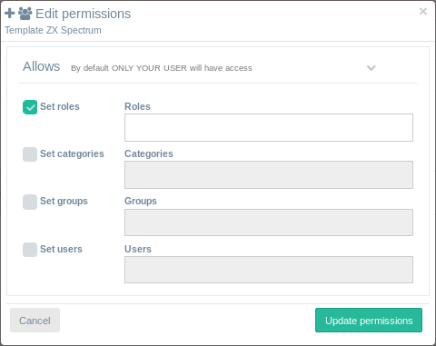

<h1>Permite</h1>

Este formulario le dará al usuario la posibilidad de compartir recursos con otros roles, categorías, grupos y usuarios

[TOC]

# Entendiendo los permisos

Hay una clasificación jerárquica de usuarios basada (de arriba a abajo):

1. ROLES
2. CATEGORIAS
3. GRUPOS
4. USUARIOS

Esa clasificación establecerá el acceso a la aplicación web IsardVDI (roles) y también a su cuota (categorías, grupos y usuarios). También establecerá dónde se almacenarán los recursos del usuario en el servidor:

​	`...<role>/<category>/<group>/<username>/...`

## Roles

La función define principalmente dónde tendrán acceso esos usuarios dentro de la aplicación web IsardVDI:

| ROLES          | USER ACCESS   | ADMIN ACCESS |
| -------------- | ------------- | ------------ |
| Administrators | FULL          | FULL         |
| Advanced Users | FULL          | NONE         |
| Users          | Desktops only | NONE         |

##  Categorías y grupos

Estas son solo clasificaciones de usuarios que les fijarán sus cuotas. Por defecto, está la categoría y el grupo Local donde todos los nuevos usuarios creados serán

## Usuarios

Por supuesto que está el usuario. Se pueden configurar diferentes cuotas para cada usuario si es necesario.

# Permite formulario

Los usuarios pueden compartir plantillas y medios con otros con este formulario. Por defecto, no se dará acceso a nadie (no se marca nada).

- **NO HAY UNO PERMITIDO** (predeterminado): no se comprueba nada. Eso significa que no se debe hacer coincidir ningún rol, categoría, grupo y usuario. Sólo el propietario tendrá acceso.

- **TODOS PERMITIDOS**: Si marca (y activa) cualquier casilla de verificación de rol, categoría, grupo o usuario, pero no agrega ninguna en el cuadro de búsqueda al lado, coincidirá con CUALQUIERA.

- **ALGUNOS PERMITIDOS**: Para permitir solo un determinado rol, categoría, grupo o usuario, simplemente marque la casilla de verificación y búsquelo en el cuadro de búsqueda al lado. Tenga en cuenta que si deja el cuadro de búsqueda vacío, todos tendrán acceso a esa plantilla o medios.

