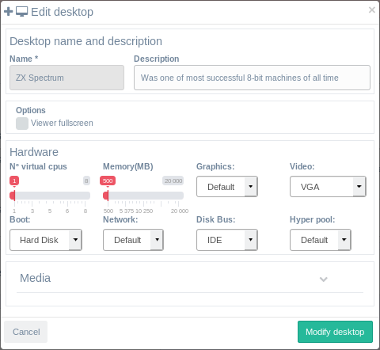
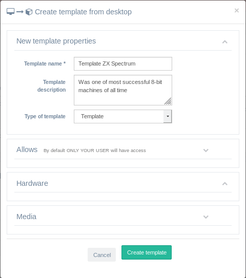

<h1>Escritorios</h1>

El menú de escritorios te permitirá gestionar tus propios escritorios.

[TOC]

# Añadir nuevo escritorio

Tiene un botón en la esquina superior derecha que abrirá un formulario modal donde puede elegir una plantilla de escritorio como base para su nuevo escritorio y configurar el hardware dentro de los límites de sus cuotas de usuario.

NOTA: SI no hay plantilla para elegir, [create one from an existing desktop](desktops.md#convert-to-template) or [create new one installing it from a downloaded media ISO](media.md#create-new-desktop-from-uploaded-media).

Debe rellenar el formulario y hacer clic en crear escritorio:

- **Nombre**: Complete su nombre de escritorio deseado
- **Descripción**: dale una descripción (opcional)
- **Buscar una plantilla de selección**: Encuentre una plantilla usando el cuadro de entrada de búsqueda que filtrará la lista de tablas de plantillas y haga clic en la plantilla desde la que desea crear su escritorio.
- **Configurar hardware**: Después de seleccionar una plantilla, aparecerá un botón que abre una selección de hardware que puede elegir para su nuevo escritorio, siempre dentro de los límites de sus cuotas de usuario.

Después de crear el escritorio, lo encontrará en estado detenido con un botón verde para iniciarlo. Si lo inicia, se mostrará un formulario de visor modal donde podrá elegir su tipo de conexión.

## Conectar al espectador

La primera vez que inicie un escritorio, se le presentará un formulario de selección de espectador con todos los tipos de conexiones disponibles para su escritorio:

| CONNECTION TYPE                                 | **CLIENT NEEDED**                                            | **SECURE** |
| ----------------------------------------------- | ------------------------------------------------------------ | ---------- |
| **Spice client** <u>(PREFERRED CLIENT)</u> | **Linux**: virt-viewer (debian based), remote-viewer (RH based)  **Win**: [virt-viewer](https://virt-manager.org/download/sources/virt-viewer) **Mac**: No client tested to be working **Android**: [aSpice viewer](https://play.google.com/store/apps/details?id=com.iiordanov.freeaSPICE) **iOS**: [FlexVDI](https://itunes.apple.com/us/app/flexvdi-client/id1051361263) | YES        |
| **Spice browser**                               | Any modern browser: Firefox, Chromium, ...                   | YES        |
| **VNC browser**                                 | Any modern browser: Firefox, Chromium, ...                   | YES        |
| **VNC client**                                  | **Linux**: vinagre -F console.vv  **Win**: [RealPlayer](https://www.realvnc.com/en/connect/download/viewer/linux/) ***1** **Mac**: Default VNC client in Mac works **Android**: Not tested **iOS**: Not tested | NO***2**   |

***1**: Al abrir el archivo en RealPlayer se le pedirá una contraseña. Puede copiar y pegar la contraseña desde los detalles del escritorio.

***2**: Las conexiones VNC en KVM a través de un cliente VNC no se están cifrando. Para conectarse de forma segura con VNC, debe utilizarse un túnel encriptado o una conexión VPN previamente creados.

# Detalles del escritorio

Cuando haga clic en el signo + a la izquierda de cada escritorio, se abrirá una vista de detalles. Allí encontrará acciones e información sobre el hardware de escritorio que se está utilizando y la información de estado del sistema.

## Editar escritorio

Cuando se detenga el escritorio, podrá editarlos en el formulario de edición que se abrirá:

- **Descripción**: Esto es opcional y puede ser actualizado.
- **Options**:
  - Visor en pantalla completa: si se marca, se establecerá ese parámetro en los archivos del cliente para que abra automáticamente el invitado en pantalla completa.
- **Hardware**: Aquí puede modificar el hardware, las redes y el arranque para ese escritorio dentro de la cuota y los permisos para su usuario.
- **Media**: Aquí puede agregar o eliminar imágenes ISO y de disquete que ya se cargaron en el sistema y se compartieron con su usuario, grupo, categoría o rol.

Cuando termine y haga clic en el botón **Modificar escritorio**, el motor IsardVDI realizará una serie de operaciones para garantizar que la nueva configuración de escritorio pueda iniciarse en el sistema. Si finaliza en un estado de falla, debe revisar sus modificaciones.

## Eliminar ecritorio

Cuando el escritorio está parado puedes borrarlo. Esta acción solicitará confirmación ya que **NO ES REVERSIBLE**. Perderás todo lo relacionado con ese escritorio.

## Crear plantilla

Cuando se detiene un escritorio, encontrará en sus detalles (haciendo clic en el botón + a la izquierda) un botón para Plantilla. El formulario para crear una plantilla le pedirá alguna información:

- **Nombre**: Asígnele un nombre que los usuarios buscarán cuando creen un nuevo escritorio a partir de esa plantilla.
- **Descripción:**: Opcional pero dará información a los usuarios sobre.
- **Tipo**: solo los roles de administrador verán esta opción que permite elegir dónde se almacenará la nueva plantilla, ya sea en la carpeta de bases o en la carpeta de plantillas.

- **Permite**: Si abre la sección de permisos, podrá decidir qué roles, categorías, grupos y usuarios individuales desea compartir esta plantilla. Eso significa quién podrá encontrar esta plantilla al crear un nuevo escritorio. Por defecto, todas las opciones están desactivadas, lo que significa que nadie verá esta plantilla. Si agrega un rol completo, todas las categorías en ese rol verán esa plantilla. Lo mismo con grupos y usuarios.
- **Hardware**: Ahora puede configurar el hardware predeterminado que necesitará esta plantilla. Los usuarios podrán modificar ese hardware al crear sus escritorios basados ​​en esta plantilla pero dentro de su cuota.

Al hacer clic en el botón Crear plantilla, se producirán dos acciones principales:

1. Su disco de escritorio se moverá a la nueva plantilla, eliminando así su escritorio actual.
2. Un nuevo escritorio de la nueva plantilla se creará idéntico al que tenía antes de crear la plantilla. Todos los cambios que hagas de ahora en adelante a ese escritorio ya no estarán conectados a la plantilla.

Ahora todos los usuarios con los que compartiste esa plantilla podrán crear un escritorio idéntico a esa plantilla en el momento de la creación.

**<u>ALERTA</u>**: <u>El proceso de creación de una plantilla creará una COPIA EXACTA del escritorio de origen. Eso significa que todo lo que haya almacenado en ese escritorio también se replicará en esa plantilla, y los usuarios que creen escritorios a partir de esa plantilla TENDRÁN UNA COPIA EXACTA de ese escritorio. Verifique dos veces antes de crear una plantilla que los navegadores no almacenen en sus cuentas de correo electrónico y que no haya almacenado información personal en el escritorio.</u>
